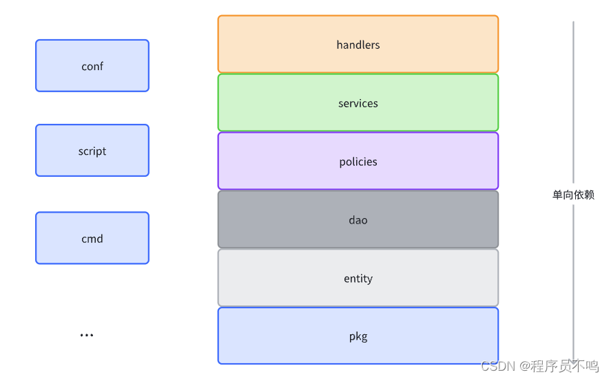

```
/
├── cmd/
│   └── myapp/
│       └── main.go
├── internal/
│   ├── user/
│   │   ├── handler.go
│   │   └── service.go
│   ├── feed/
│   │   ├── handler.go
│   │   └── service.go
│   ├── repository/
│   │   ├── user_repository.go
│   │   └── feed_repository.go
│   └── shared/
│       └── services/
│           ├── user_service.go
│           └── feed_service.go
├── pkg/
│   ├── utils/
│   ├── constants/
│   ├── models/
│   ├── errors/
│   └── logger/
└── go.mod
```
在这个结构中：

internal 包含了应用特定的代码，包括模块（user, feed）、存储库和内部共享服务。

pkg 包含了可能被其他项目复用的代码，如工具函数、常量、模型定义等。

shared 目录放在 internal 下，因为这些共享服务可能包含应用特定的逻辑，不适合被外部项目直接使用。

如果有些服务或组件确实需要在多个项目间共享，可以考虑将它们移到 pkg 目录下。

这种结构既遵循了 Go 的最佳实践，又保持了代码的模块化和可维护性。同时，它也明确区分了哪些代码是应用特定的（在 internal 中），哪些是可以被其他项目复用的（在 pkg 中）。

再次感谢您的指正，这有助于提供更准确和符合 Go 标准的建议。




由于 Golang 是不支持包之间循环依赖的，所以从 hanlders 到 pkgs，均为单向依赖。下面介绍各个层级的含义，以及要做的事情。
### 2.1.pkg

pkg 包存放与业务逻辑无关的工具包，如格式化工具、结构体转换工具等。

```
pkg/
 |- formatter/
  |- formatter.go
 |- converter/
  |- converter.go
```

- converter.go

```
funcobj2String(objinterface{}) (string, error) {
    bytes, err := json.Marshal(&obj)
if err != nil {
return "", err
    }
returnstring(bytes), nil
}
```

### 2.2.entity

entity 包存放领域实体及其相关方法及枚举。

- entity 包只能提供最基本的和实体相关的方法，如定义了 User 结构体，提供 IsValidUser 方法判断该 User 是否有效等。
- entity 包不依赖于其他任何包（基础类库、pkgs 包）除外，只提供最基础的领域模型定义。

```
entity/
 |- user.go
 |- item.go
```

- user.go

```
type UserType string

const (
    UserTypeAdmin  UserType = "admin"
    UserTypeNormal UserType = "normal"
)

type User struct {
    UserType UserType
    UserID   int64
    UserName string
}

func (u *User) IsAdmin() bool {
    return u.UserType == UserTypeAdmin
}
```

### 2.3.dao

dao 包存放于数据库交互的所有代码，即数据的增、删、改、查。

- dao 包包含领域模型的所有数据 CRUD 操作
- dao 包不包含业务逻辑相关的操作

```
dao/
 |- dao.go
 |- user_dao.go
```

- dao.go

```
var UserDao UserDaoIF

funcInitDAO() {
    UserDao =new(userDao)
}
```

- user_dao.go

```
type UserDaoIFinterface {
    GetUser(userID int64) (*entity.User, error)
    CreateUser(user *entity.User) error
}

type userDaostruct{}

// CreateUser implements UserDaoIF
func (*userDao) CreateUser(user *entity.User) error {
    panic("unimplemented")
}

// GetUser implements UserDaoIF
func (*userDao) GetUser(userID int64) (*entity.User, error) {
    panic("unimplemented")
}
```

### 2.4.policies

policies 包存放和业务逻辑校验、实体验证相关的代码。

```
policies/
 |- policy.go
 |- user_policy.go
```

- policy.go

```
var UserPolicy UserPolicyIF

funcInit() {
    UserPolicy =new(userPolicy)
}
- user_policy.go
type UserPolicyIFinterface {
    CanLogin(userID int64)boolCanRegister(userID int64)bool
}

type userPolicystruct{}

// CanLogin implements UserPolicyIF
func (*userPolicy) CanLogin(userID int64)bool {
    panic("unimplemented")
}

// CanRegister implements UserPolicyIF
func (*userPolicy) CanRegister(userID int64)bool {
    panic("unimplemented")
}
```

### 2.5.services

services 存放业务逻辑相关代码，是整个项目中逻辑最复杂的部分。

```
services/
 |- service.go
 |- user/
  |- user_service.go
 |- item/
  |- item_service.go
```

- service.go

```
var UserService UserServiceIF

funcInit() {
    UserService =new(userService)
}
- user_service.go
type UserServiceIFinterface {
    UserLogin(u *entity.User) error
}

type userServicestruct{}

// UserLogin implements UserServiceIF
func (*userService) UserLogin(u *entity.User) error {
    panic("unimplemented")
}
```

### 2.6.handlers

handlers 定义了各类对外处理器入口，如 http、rpc、eventbus 等处理器。

- handlers 中的处理器只做三件事情：接受请求解析入参、调用 services 完成业务逻辑、构造响应参数
- handlers 不包含业务代码逻辑，应该简单地作路由使用

```
handlers/
 |- handler.go
 |- rpc/
  |- user_rpc.go
 |- http/
  |- item_http.go
```

### 2.7. 其他包

- conf 包：存放相关的配置文件，如 config_prod.yaml 等
- script 包：存放系统相关的脚本，如编译脚本 build.sh 等
- cmd 包：存放相关的可直接运行的 go 脚本，如刷数脚本 reflush.go 等


https://github.com/danceyoung/paper-code/blob/master/package-oriented-design/packageorienteddesign.md

https://wrong.wang/blog/20181003-go-web%E5%90%8E%E7%AB%AF%E9%A1%B9%E7%9B%AE%E5%A6%82%E4%BD%95%E7%BB%84%E7%BB%87/
http://www.lsdcloud.com/go/middleware/go-coding-standard.html

为单独的Handler定制Request或Response类型。#
某一条路由可能需要它特有的request和response类型，这种情况下，你可以在函数内部声明特有类型：

```go
func (s *server) handleSomething() http.HandlerFunc {
    type request struct {
        Name string
    }
    type response struct {
        Greeting string `json:"greeting"`
    }
    return func(w http.ResponseWriter, r *http.Request) {
        ...
    }
}
```

这样做保护了包级别的命名空间，在不同Handler中你可以声明相同名字的不同结构体。写测试代码时，复制粘贴相同的声明代码到相应的测试函数中就行了。这有助于后来人理解你的代码。


```azure
+--bin 编译后的文件
+--pkg 本项目或其他项目使用的包
项目根目录
  +--api 接口规范目录
  +--cmd
  +--swagger 自动化API文档
  +--test 该目录放的是临时的测试方法
  +--config 所有的配置文件目录
  +--internal 只在本项目使用的包
  +-- doc 说明文档（含go-bindata和mysql文件）
  +-- exec_package 可执行的打包文件（目前只有win 64bit的打包）
  +-- inits 所有需初始化的目录
  |       +-- parse 所有配置文件的初始化目录
  |       +-- init.go 用于初始化系统root用户，并注入所有service
  +-- middleware 包含的中间件目录
  |       +-- casbins 用于rbac权限的中间件的目录
  |       +-- jwts jwt中间件目录
  +-- resources 打包的前端静态资源文件
  |       +--img 静态图片 
  |       +--html  网页资源
  |       +--file 文件资源
  +-- utils 工具包目录
  +--plugin 插件，扩展码的包
  +-- web
  |       +-- db 数据库dao层目录
  |       +-- models  models 存放实体类
  |       +--service 业务逻辑
  |       +-- controller 所有分发出来的路由的目录
  |       +-- supports 提供辅助方法的目录（可以无）
  +-- main.go 入口
```